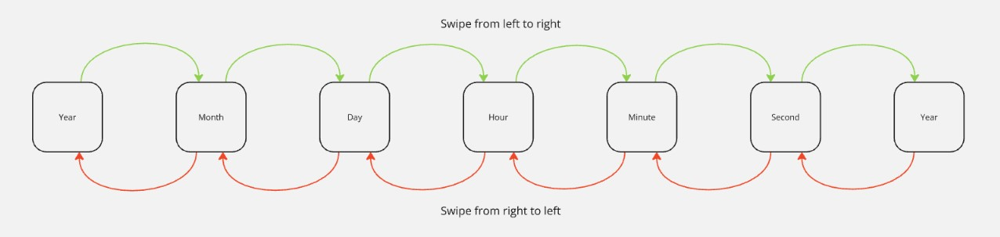

# PSoC6_RTC_TFT
In this project a clock is made that you can set using the capsense sensor. 

## What has been used
### Meterial
* [PSoC 6 wifi-bt pioneer kit](https://www.infineon.com/cms/en/product/evaluation-boards/cy8ckit-062-wifi-bt/)
* [CY8CKIT-028-TFT display shield](https://www.infineon.com/cms/en/product/evaluation-boards/cy8ckit-028-tft/)

### Software
* [ModusToolbox](https://www.infineon.com/cms/en/design-support/tools/sdk/modustoolbox-software/)

### Peripheries
* Capsense sensor (slider, button 0 and button 1)
* TFT-display
* Ambient light sensor
* RTC
* Timer
    * Timer
    * Timer interrupt

## How does it work
### Time initialize
In the photo below you see the start screen afther programming the PSoC.

By sliding from the left to the right side of the capsence slider, you select the next time element (eg: From year to month, from month to day). By sliding from the right to the left side of the capsence slider, you can select the previous time element (eg: From month to year, from day to month)

WIth the left capsence button (button 0) you can decrease your time element, and with the right capsence button (button 1) you can increase your time element.

  
Flowchart of configuring year

  

The values on the TFT-display will be updated and shown.

When you configured the right time, you can push the user button (sw2). By presing this button the RTC will set himself with this time. And the time will be displayed on the TFT-shield.

Every second a timer will generate an interrupt to update the current time on the TFT-shield. First I wanted to use a RTC interrupt for it, but the TFT-shield does not wanted to work in a RTC interrupt.

With the ambient light sensor you can check the light intensity in the room. When the sensor measure a light intesity that is to low (eg: During the night) it will change the color of the text on the TFT-shield from white to red. If the light intesity is hight enough, the text will change again from red to white.

## Experience
* The TFT-Shield does not want to work in a RTC interrupt, but will work in a timer interrupt.
* When there is text displayed on the TFT-shield, and you overwrite this text with a shorter text then the last characters of the longer text will be still displayed.
* When a new day start it is better to clear the whole TFT-shield

## Source
ModusToolbox documentation